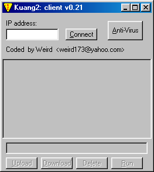
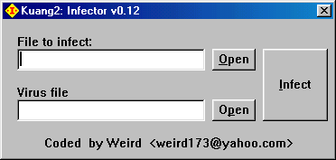

# Kuang2 - the Virus

🤷‍♂️ Some code I wrote long time ago... for fun and non-profit.

🚀 Pull Requests & contributions are welcomed!

💜 Enjoy.

## Win32.Weird

It is a non dangerous memory resident parasitic Win32 virus. It writes itself to the end of PE EXE files (Windows executable) by increasing last file section and modifying PE header fields. The virus copy in infected files consists of two parts. First part (starter) is a short routine (about one kilobyte of code and data), the second part is the main virus code (about 10Kb of size) encrypted with silly encryption loop. 

When the infected file is executed, the starter takes control, decrypts the second part of virus code, drops it to Windows directory as a PE EXE file with random name and executes it. The main virus instance stays memory resident as a hidden Windows application, runs a low priority thread that periodically scans drives' directory trees, looks for PE EXE files and infects them. 

The virus also affects the EXPLORER.EXE file. It copies it with the EXPLORER.E name, infects this copy and writes the [rename] instruction to the WININIT.INI file to replace original EXPLORER.EXE with infected copy on next Windows startup. 

The virus has a backdoor ability. When it is active as a Windows application it opens Internet connection and waits for specific calls from there. The virus has a little list of supported commands compared to other known backdoors, but it allows to upload, download, execute and delete files on the infected machine from remote host. 

The virus contains the "copyright" text:

```
#Coded by Weird#
```

## Project

+ `client` is simple GUI app that connects to infected computer and gains access to it. 
+ `server` contains the virus code and the simple 'infector' app - that infects an `.exe` of your choice. 

I was using Watcom compiler and custom stub libs. At the moment, I am not able to rebuild the code (but at least know how:)